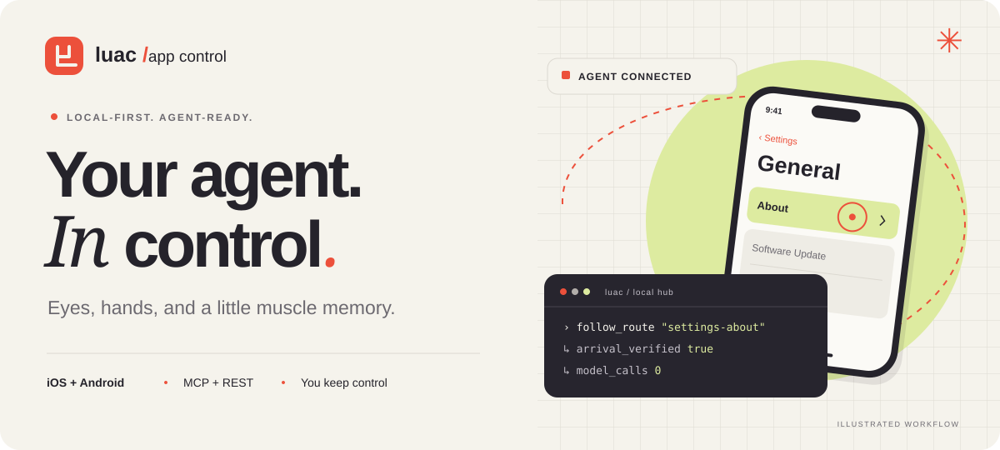

<p align="center"></p>

# lu-app-control · Website

**Des yeux, des mains et un peu de mémoire pour vos agents IA.**

[Voir la landing →](https://ludwig-pro.github.io/lu-app-control-site/)

Ce dépôt héberge uniquement la présentation statique de lu-app-control : HTML, CSS,
JavaScript, illustrations originales et polices locales. La démonstration est une
illustration interactive, sans connexion à un hub, appareil ou fournisseur IA.

Le projet principal reste en **bêta interne privée**, avec un paquet npm non publié.
Son ouverture open source attend la validation du propriétaire.
[Le dépôt du hub](https://github.com/ludwig-pro/lu-app-control) nécessite un accès.

## Prévisualiser

```sh
python3 -m http.server 4176 --bind 127.0.0.1
```

Ouvrir `http://127.0.0.1:4176/`. Les chemins relatifs fonctionnent aussi sous le
préfixe GitHub Pages. La page respecte la préférence de mouvement réduit et permet
de mettre les animations en pause ; les onglets Learn / Replay / Adapt sont
accessibles au clavier.

## Hébergement

GitHub Pages publie la branche `main`, à la racine `/`, avec `.nojekyll`.
Chaque push sur cette branche redéploie le site. Les fichiers publics sont exportés
depuis le checkout de travail du projet par une liste explicite ; aucun code du hub,
rapport interne ou fichier de configuration d’hébergement n’est copié ici.

Licence [MIT](LICENSE.txt) © 2026 Ludwig Vantours. Les licences SIL Open Font de
Manrope et Instrument Serif sont fournies dans `assets/`.
